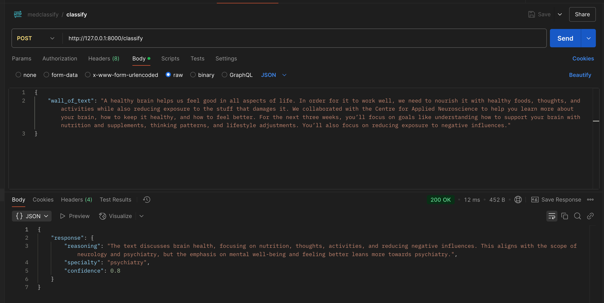
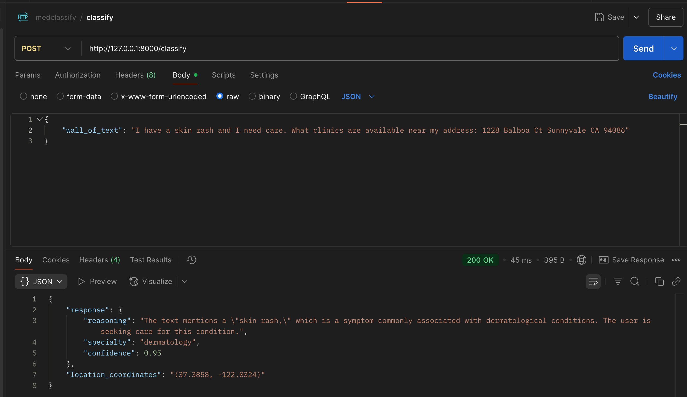

# Medical Specialty Classifier
<tbd>

## Usage
This code uses [DSPy](https://dspy.ai/) + VertexAI via LiteLLM integration.
It also uses ReAct paradigm to extract coordinates using [Google Maps MCP Server](https://github.com/modelcontextprotocol/servers/tree/main/src/google-maps)
Read these [pre-requisites](https://docs.litellm.ai/docs/providers/vertex#pre-requisites)
So to setup the creds, hit
```bash
gcloud auth application-default login  
```

And ensure u add your respective `project` and `location` in `.env` file which gets loaded up at init.
Use this command to kickstart the webserver:
```bash
 fastapi dev main.py
```

Then trigger a `cURL` using:

```bash
curl --location 'http://127.0.0.1:8000/classify' --header 'Content-Type: application/json' --data '{"wall_of_text":"A healthy brain helps us feel good in all aspects of life. In order for it to work well, we need to nourish it with healthy foods, thoughts, and activities while also reducing exposure to the stuff that damages it. We collaborated with the Centre for Applied Neuroscience to help you learn more about your brain, how to keep it healthy, and how to feel better. For the next three weeks, you’ll focus on goals like understanding how to support your brain with nutrition and supplements, thinking patterns, and lifestyle adjustments. You’ll also focus on reducing exposure to negative influences."}'
```





The  console logs:
```bash
(med-classifier) ➜  med-classifier git:(main) fastapi dev main.py

   FastAPI   Starting development server 🚀
 
             Searching for package file structure from directories with __init__.py files
             Importing from /Users/bthomas-mac/personal/python/med-classifier
 
    module   🐍 main.py
 
      code   Importing the FastAPI app object from the module with the following code:
 
             from main import app
 
       app   Using import string: main:app
 
    server   Server started at http://127.0.0.1:8000
    server   Documentation at http://127.0.0.1:8000/docs
 
       tip   Running in development mode, for production use: fastapi run
 
             Logs:
 
      INFO   Will watch for changes in these directories: ['/Users/bthomas-mac/personal/python/med-classifier']
      INFO   Uvicorn running on http://127.0.0.1:8000 (Press CTRL+C to quit)
      INFO   Started reloader process [17337] using WatchFiles
      INFO   Started server process [17372]
      INFO   Waiting for application startup.
      INFO   Application startup complete.
Classifying wall of text: A healthy brain helps us feel good in all aspects of life. In order for it to work well, we need to nourish it with healthy foods, thoughts, and activities while also reducing exposure to the stuff that damages it. We collaborated with the Centre for Applied Neuroscience to help you learn more about your brain, how to keep it healthy, and how to feel better. For the next three weeks, you’ll focus on goals like understanding how to support your brain with nutrition and supplements, thinking patterns, and lifestyle adjustments. You’ll also focus on reducing exposure to negative influences.
response: Prediction(
    reasoning='The text discusses brain health, focusing on nutrition, thoughts, activities, and reducing negative influences. This aligns with the scope of neurology and psychiatry, but the emphasis on mental well-being and feeling better leans more towards psychiatry.',
    specialty='psychiatry',
    confidence=0.8
)


[2025-05-05T19:06:36.556753]

System message:

Your input fields are:
1. `wall_of_text` (str)
Your output fields are:
1. `reasoning` (str)
2. `specialty` (Literal['dermatology', 'orthopedics', 'cardiology', 'neurology', 'psychiatry', 'pediatrics', 'internal medicine', 'family medicine', 'emergency medicine', 'radiology'])
3. `confidence` (float)
All interactions will be structured in the following way, with the appropriate values filled in.

[[ ## wall_of_text ## ]]
{wall_of_text}

[[ ## reasoning ## ]]
{reasoning}

[[ ## specialty ## ]]
{specialty}        # note: the value you produce must exactly match (no extra characters) one of: dermatology; orthopedics; cardiology; neurology; psychiatry; pediatrics; internal medicine; family medicine; emergency medicine; radiology

[[ ## confidence ## ]]
{confidence}        # note: the value you produce must be a single float value

[[ ## completed ## ]]
In adhering to this structure, your objective is: 
        Classify a wall of text to an appropriate medical specialty and confidence score. If nothing matches (confidence is less than 0.5), return ''


User message:

[[ ## wall_of_text ## ]]
A healthy brain helps us feel good in all aspects of life. In order for it to work well, we need to nourish it with healthy foods, thoughts, and activities while also reducing exposure to the stuff that damages it. We collaborated with the Centre for Applied Neuroscience to help you learn more about your brain, how to keep it healthy, and how to feel better. For the next three weeks, you’ll focus on goals like understanding how to support your brain with nutrition and supplements, thinking patterns, and lifestyle adjustments. You’ll also focus on reducing exposure to negative influences.

Respond with the corresponding output fields, starting with the field `[[ ## reasoning ## ]]`, then `[[ ## specialty ## ]]` (must be formatted as a valid Python Literal['dermatology', 'orthopedics', 'cardiology', 'neurology', 'psychiatry', 'pediatrics', 'internal medicine', 'family medicine', 'emergency medicine', 'radiology']), then `[[ ## confidence ## ]]` (must be formatted as a valid Python float), and then ending with the marker for `[[ ## completed ## ]]`.


Response:

[[ ## reasoning ## ]]
The text discusses brain health, focusing on nutrition, thoughts, activities, and reducing negative influences. This aligns with the scope of neurology and psychiatry, but the emphasis on mental well-being and feeling better leans more towards psychiatry.

[[ ## specialty ## ]]
psychiatry

[[ ## confidence ## ]]
0.8

[[ ## completed ## ]]


cost: 6.15e-05
cost: {}
      INFO   127.0.0.1:53452 - "POST /classify HTTP/1.1" 200
```